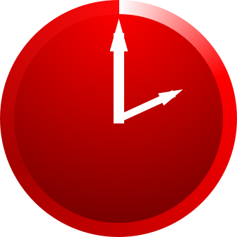

    
     

# Dex

`Dex` is a Pomodoro time, task, and worklog tracking platform.

## NOTICE: Active Development

`Dex` is still in its early stages of development. Feel free to watch this
project as it grows and use the issues section to put in any questions or ideas
you may have. Nothing in this project promises to be stable until we reach a
`v1.0.0`.

## Overview

`Dex` enforces the time tracking of projects based on the [**Pomodoro
Technique**](https://lifehacker.com/productivity-101-a-primer-to-the-pomodoro-technique-1598992730),
which pushes for 25 minute long work sessions with a 5 minute break in between.
`Dex` pushes this further to encourage work log entries after each session in
order to provide transparency into projects worked on. The combination of this
transparency and efficiency leads to the potential to grow a new form of Agile
Development tailored to Freelance/Solo Software Developers where the progress is
transparent to those following them (clients, supervisors, product owners,
etc.). Ultimately this should reduce the amount of time spent in meetings and
increase the amount of development completed ***threefold***.

## History

I, Ray Benefield, have been working in 25 minute Pomodoros for about a year and
prior to that I worked to lower my increment of sit down time on a single
problem. I've found that the **Pomodoro Technique** has proven to be extremely
powerful for me as a Software Architect/Engineer. Earlier this year I was
working on a project where I wanted to share my progress. I realized from
the reception that the transparency of keeping a work log after each session can
really have massive benefits for those following and potentially for those
managing as well as for those you are building for.

I have been keeping worklogs of my sessions ever since and I've determined that
I need a centralized platform instead of a bunch of bash scripts that allow me
to manage the worklog. I also realized that there might be others out there that
would really benefit from something that pushes for this combination of
transparency and efficiency. So I've been planning to build this platform for a
while, but with the discovery of the [**ProductHunt Global
Hackathon**](https://www.producthunt.com/hackathon) and the recent loss of my
job I decided now was the time to jump into this as this could improve my
agility across the board in all future projects.

## Planned Roadmap

The **MVP** of `Dex` shoots to accomplish the following use cases:

 - *Start a timer on the Command Line Interface (CLI), installable through NPM*
 - *Get a notification at the completion of a **Pomodoro** (25 minutes)*
 - *Track overtime past the **Pomodoro***
 - *Log Double, Triple, Quadruple, etc. sessions*
 - *Upon ending the timer, store a worklog entry associated to that session*
 - *REST/RPC API for external developers to develop integrations*

**Post-MVP** the roadmap will most likely include the following:

 - *Organize sessions/worklogs by Clients, Projects, and Entities of Projects*
 - *Track a Todo list that can be aggregated for Clients, Projects, and
   Entities*
 - *View Todo list before and after a session*
 - *Support Webhooks to allow for integration of apps through session events*
 - *Hooks on the CLI for project automation (like generating Markdown for a
   project)*
 - *Support for additional platforms like **Slack**, **Facebook Messenger**,
   **Trello**, etc.*
 - *Support for additional hardware like **Mac**, **PC**, **Android**, **IOS**,
   **Amazon Echo**, **Google Assistant**, **SMS**, etc.*
 - *Track breaks and notify on platform of choice of the end of a break*
     - *Start a session on the CLI, get notification of the end of a break on
       your phone while away from your computer*
 - *Gamification around session completion*
     - *Shallow/Deep Block tracking awareness*
     - *Daily Pomodoro Goals*
 - *Statistics on Productivity*
     - *Punchcard of common sessions*
     - *How much overtime spent*
 - *Request work from a developer*
 - *Follow developers (and other social networking concepts)*

## Resources

 - [**Original Pomodoro Paper by Francesco
   Cirillo**](http://www.baomee.info/pdf/technique/1.pdf)
 - [**[Lifehacker] Productivity 101: A Primer to The Pomodoro
   Technique**](https://lifehacker.com/productivity-101-a-primer-to-the-pomodoro-technique-1598992730)

## Team

| |
|:---:|
|[Ray Benefield](https://github.com/RayBenefield) |
|[Software Architect](https://en.wikipedia.org/wiki/Software_architect) |
