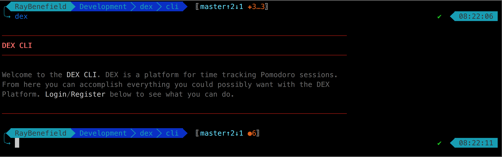

# Worklog

## #7

Setup an initial readme file for the project and the CLI tool. Filled in some
history as well as a potential roadmap and some other little fine tuning
details. Also adjusted some of the CLI publishing to take into account the
readme file.

## #6

Started work on the **ProductHunt Ship** page for entry into the Hackathon's
first deliverable. Got a sense of things that existed there and what the Ship
page was all about. While I was at it I also setup a sort of intermediary idea
for a logo which wasn't actually that bad. I'll find somebody to make a better
logo for me later. Here it is below:

## #5

Continued with the interface design by setting up the menu after logging in and
maintianing state during that menu. Then setting up a bottom bar for the menu
that updates regularly which will hold our timer later. Then setup a quit action
to let users exit the program and got the initial groundwork for the start timer
action. Next I'll have to explore changing the menu when the timer is running
vs not running and then setup the action to stop the timer.

## #4

Went through to get the prompt system working properly so I can get interface
design going. Got the initial login menu setup and next I'll be working on
getting the actual timer menu setup which should be relatively simple, but might
not be because of the damn bottom bar that will constantly be updating. We'll
see how well that goes.

## #3

Decided to work on the CLI tool right away and jump right into interface design.
Created the project folder and made modifications to make sure it was easy to
publish every time I needed to. Made sure versioning was working correctly and
everything. Should be good to go now and I'll just start working on the
interface interaction design now and then get back to use cases another time.

## #2

Spent some time organizing the Brainstorming done in the first session into
Business, Product, and Technology concerns. Then started work on the initial use
cases. Got about halfway through, luckily this is a very small MVP with just a
simple time tracker that is aware of 25 minute sessions is all. Below you can
see the current progress:

Product left, Business center, Technology right

## #1

Initial brainstorming for my Pomodoro Technique time tracking application for
the [**ProductHunt Global Hackathon**](https://www.producthunt.com/hackathon).
Just spit out a bunch of ideas that I could think of before jumping in to
things. Below is an image of the initial thoughts:

